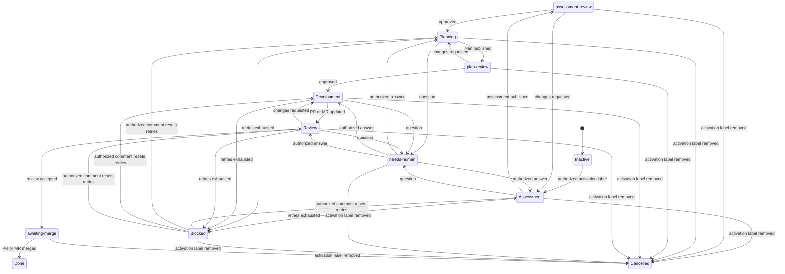
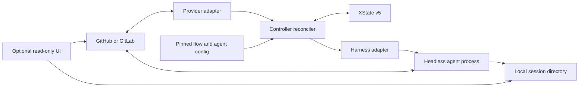

# Agent flow controller architecture

Status: Draft

This document records the agreed target architecture for a controller that partially automates development work from
GitHub or GitLab tickets. It is not a description of the current `reviewctl` implementation and does not replace the
accepted MVP design in [`architecture.md`](architecture.md).

## Purpose

The controller moves a ticket through architectural assessment, planning, development, review, rework, and merge. A
different headless agent may handle each stage. Humans may approve intermediate results or answer questions, depending
on the configured flow policy.

The controller coordinates the work. Agents remain responsible for their domain work and publish their own final
results. GitHub or GitLab is the source of truth for every operational decision.

The current repository is only a temporary home for this design. The target implementation may replace the existing
`reviewctl` code, use another language, move to another repository, or take another name. Existing code is reused only
when it shortens the implementation without weakening these invariants.

## Agreed invariants

### Source of truth

- GitHub or GitLab stores all canonical operational state. The controller must not require a database, durable queue,
  lease store, or local retry ledger.
- The current state must be reconstructible from the ticket, its labels, marked comments, linked pull or merge request,
  and provider metadata.
- Local workspaces and session files are diagnostic artifacts. Losing them may require a new attempt, but must not make
  the ticket state ambiguous or change the next valid transition.
- Agents publish final artifacts and outcomes to the provider. They do not publish complete session transcripts.
- Each flow instance has one machine-marked control comment. The controller updates it in place with the current state,
  retry consumption, attempt metadata, and latest receipts.
- The control comment contains the flow instance identity and pinned configuration revision. Its SHA field changes only
  during an explicit migration.
- The current XState state is exposed as exactly one controller-owned `agent-stage:<state-id>` label for provider
  searches and queues. There is no separate `agent-status:*` label dimension.
- One ticket has at most one active flow instance.

### Flow versioning

- Flow and agent configuration lives in one Git repository.
- A new flow instance pins the configuration repository commit SHA that was current when the instance started.
- The controller records that SHA in the control comment it creates for the instance.
- The pinned configuration revision includes every `apm.lock` produced for the agent catalog. External APM artifacts
  must resolve through a committed lockfile.
- Fetching a newer configuration revision must not change a running instance.
- A running instance changes its pinned revision only through an explicit migration.

### Activation and cancellation

- The exact `agent-flow:development` label starts a development flow.
- Only a provider user with `write` or `maintain` access may start or resume a flow.
- On the first accepted activation, the controller adds `agent-flow:managed`. This discovery label is permanent and
  remains after completion, cancellation, and later flow instances.
- When a flow reaches `done`, the controller removes `agent-flow:development` and leaves `agent-flow:managed` and
  `agent-stage:done` on the ticket.
- Reapplying the activation label after a completed or cancelled run creates a new flow instance.
- Removing the activation label cancels the active agent process when the controller observes the removal and prevents
  new attempts from starting.
- Closing a ticket with an active flow also cancels the instance, stops the active agent process, and removes
  `agent-flow:development`. Reopening the ticket does not resume the cancelled instance; a new run requires the
  activation label to be applied again.
- If the same provider update contains a merged pull or merge request that completes a flow in `awaiting-merge`, the
  controller applies `done` rather than treating the resulting ticket closure as cancellation.
- An agent result that arrives after the controller observes cancellation must not advance the flow.
- Cancellation detection need not be instantaneous. The controller must act on the removal once periodic
  reconciliation observes it.
- The initial version discovers provider changes only through periodic reconciliation. It does not receive webhooks.
- Only repositories in an explicit allowlist may be processed.

### Concurrency and deployment

- One deployment contains one controller instance. Multiple cooperating controllers are outside the current design.
- The controller may process different tickets in parallel.
- At most one agent process may work on a given ticket at a time, regardless of stage or retry.
- Each active flow instance has its own writable repository workspace. Concurrent tickets must never share a working
  tree.
- Each attempt starts a new headless agent process and creates a separate local session directory.
- A configurable global concurrency limit bounds parallel ticket processing.
- The deployment runs either as one Docker container or as one Kubernetes replica.
- A Kubernetes deployment uses a persistent volume for session files and the `Recreate` strategy so two controller
  replicas cannot run concurrently.

### Agent configuration and harnesses

- The configuration repository contains an `agent-packages/` catalog of agent types and the flow definitions that
  refer to them.
- Each agent type has its own directory and exactly one `apm.yml` with one logical entry agent.
- The project authors its own agent packages around its established engineering practices. A prebuilt autonomous
  development package is not the foundation of the flow.
- An `apm.yml` may reference a specific external APM artifact when the local catalog does not provide the required
  capability. External artifacts are reused individually rather than importing another orchestration flow.
- APM lockfiles are committed to the configuration repository. Updating an external artifact requires a lockfile
  update and a new configuration commit.
- APM generates files for a named target harness. The selected target must match the harness that will execute the
  agent.
- Different agent types in the same deployment may use different harnesses. For example, an architect may use Claude
  while a developer uses Codex.
- Each harness must be installed and authenticated on the executor before work starts.
- Harness adapters own command construction, startup, cancellation, exit decoding, and receipt extraction.
- The initial adapters run Codex through `codex exec` and Claude through `claude -p` as ordinary headless CLI processes
  in the prepared working directory. A Pi adapter or another harness may be added later without changing flow
  semantics.

### Provider access and publication

- GitHub agents use an already authenticated `gh`; GitLab agents use an already authenticated `glab`.
- Agents initially run under the operator's user account and have direct provider access with `write` or `maintain`
  permissions.
- Agents publish assessment, plan, questions, pull or merge request changes, review results, and other stage outputs
  themselves.
- The controller owns the reserved state labels. Agent instructions must prohibit editing them, and the controller must
  reject a transition that is not valid for the current flow state.
- Every agent-authored provider comment must contain a machine-readable marker. This is required because agent and human
  actions may use the same provider account.
- After an agent asks a question, the first later unmarked comment from a user with `write` or `maintain` access is the
  human answer. The agent type responsible for the current stage interprets the answer.
- Human gates accept ordinary comments rather than requiring a command syntax. The current-stage agent maps the first
  later authorized, unmarked comment to `approved`, `changes-requested`, `question`, or `unclear`.
- `changes-requested` means the human requires another iteration before the flow advances. `approved` may include
  explicitly nonblocking notes; the controller advances and includes the source comment in the next agent's context.
- A mixed comment without a clear blocking or nonblocking intent maps to `unclear`.
- `unclear` must not advance the flow. The current-stage agent asks for clarification, and the ticket remains at the
  human gate. A separate gate-interpreter agent is not used.
- The controller validates the human comment ID, author permission, structured verdict, and agent receipt before
  applying the corresponding transition.
- The controller accepts an agent publication only after it validates the returned receipt and reads the relevant
  provider object back.

### Development flow

- Architectural assessment is published in full as a ticket comment.
- The planning agent consumes that assessment and publishes the complete plan as a ticket comment.
- The development agent consumes the accepted ticket context, edits the repository, and creates or updates one pull or
  merge request for the ticket.
- The review agent reviews the pinned pull or merge request head. A head change invalidates an in-flight result for the
  older revision.
- If the linked pull or merge request closes without merge while the ticket remains open, the flow enters
  `needs-human`. The agent asks whether the existing change request should be reopened or the flow should be cancelled.
- The agent must not create a replacement change request automatically. The one-change-request-per-ticket invariant
  remains in force.
- Requested changes return the ticket to development. Development and review may repeat within the same flow instance.
- When the authenticated provider user authored the pull request, a GitHub review is published as a comment and
  machine-readable verdict rather than an impossible self-approval.
- Merge is manual initially. A later configuration option may enable automerge.
- Human gates are flow policy, not hard-coded stage behavior. A conservative flow may require review after intermediate
  stages; a trusted flow may pause only when an agent reports that human input is needed.
- The initial flow requires human approval after architectural assessment and after planning. It does not add another
  human gate inside the development and agent-review loop. Manual merge remains the final human decision.
- A later flow revision may remove the intermediate gates and pause only for `needs-human` or `blocked`.
- A question puts the ticket into `needs-human`. An exhausted retry budget puts it into `blocked` without starting
  another agent.

### Retries and human input

- Retry policy is configured per agent type and includes a finite attempt limit, attempt timeout, and delay.
- A retry budget belongs to one logical attempt series: one agent type working in one state on one pinned input
  revision.
- A technical failure consumes the current series budget. A successful result closes that series.
- Timeouts, unexpected process exits, and transient provider failures are retryable.
- An explicit agent request for a human decision enters `needs-human` without consuming another retry.
- Invalid configuration, a missing harness, failed authentication, an allowlist or permission violation, and an invalid
  receipt enter `blocked` immediately. Repeating the same attempt cannot repair these conditions.
- Entering a new state or observing a new pinned input revision, such as a new pull or merge request head SHA, starts
  a fresh series with the configured budget.
- Every retry uses a new agent process and a new local session directory.
- The controller records and reads back an attempt start before launching the agent. Starting the process consumes the
  attempt even if the controller or executor then crashes.
- Attempt consumption must be derivable from provider-visible machine metadata so a controller restart cannot reset the
  budget accidentally.
- After a blocked state, a later authorized, unmarked human comment resets the relevant retry budget and allows the
  same logical attempt series to continue.

## State machine

XState v5 in TypeScript is the state transition engine. The controller supplies a provider-derived snapshot and an
event to the machine, then applies the returned transition. XState persistence is not used.

Flow definitions are data-only YAML. They may declare states, transitions, agent package references, retry policy,
human gates, and names from the controller's fixed set of actions and guards. They must not contain inline JavaScript,
shell commands, or another executable extension mechanism. The controller validates the YAML and converts it to an
XState machine before activating a flow.

The stage sequence is:



The cancellation transitions also apply when the ticket closes. A merged change that completes `awaiting-merge` takes
precedence over cancellation.

The return transition from `needs-human` or `blocked` goes to the state that raised the question or exhausted its retry
budget. An authorized answer after retry exhaustion also resets that state's retry budget.

Provider labels expose the selected flow and the current machine state:

- `agent-flow:development` activates the development flow;
- `agent-flow:managed` marks tickets with flow history;
- exactly one `agent-stage:<state-id>` label maps directly to the current state ID from the pinned YAML flow.

The controller removes the previous `agent-stage:*` label when it applies a state transition. It never derives a
second status label from the state. Queue queries, the state graph, and the XState interpreter therefore use the same
state ID.

The initial development flow should use the same general vocabulary as the autonomous development experiments in
`qubership-profiler-agent`: `assessment`, `assessment-review`, `planning`, `plan-review`, `replan`, `implement`,
`working`, `testing`, `review`, `awaiting-merge`, `needs-human`, `blocked`, `done`, and `cancelled`. The YAML flow may
use only the states it needs. When a transition enters `needs-human` or `blocked`, the control comment records the
originating state so an authorized comment can resume the correct stage.

## Configuration repository

The agreed logical layout is one catalog for flows and agents:

```text
flows/
  <development-flow-definition>
agent-packages/
  architect/
    apm.yml
    .apm/
      <agent-primitives>
  planner/
    apm.yml
    .apm/
      <agent-primitives>
  developer/
    apm.yml
    .apm/
      <agent-primitives>
  reviewer/
    apm.yml
    .apm/
      <agent-primitives>
```

The names and flow file format are illustrative. The invariant is one `apm.yml` per agent type, one logical entry
agent in that manifest, and an explicit harness target selected by the flow or agent configuration. The catalog owns
the default agent behavior; external APM artifacts are optional, narrow dependencies.

## Provider state mapping

| Canonical fact | Provider representation |
| --- | --- |
| Flow activation | Authorized `agent-flow:development` label change |
| Ticket has flow history | Permanent controller-owned `agent-flow:managed` label |
| Flow instance and configuration version | One mutable control comment with instance identity and config SHA |
| Current state | Exactly one controller-owned `agent-stage:<state-id>` label |
| Assessment and plan | Full machine-marked ticket comments |
| Agent question | Machine-marked ticket comment plus `agent-stage:needs-human` |
| Human answer | First later authorized, unmarked ticket comment |
| Human gate verdict | Structured current-stage agent result tied to the human comment ID |
| Attempt start, outcome, retry consumption, and latest receipts | Mutable control comment |
| Development result | One linked pull or merge request and its pinned head SHA |
| Review result | Provider review or marked comment tied to the reviewed head SHA |
| Linked change request closed without merge | `agent-stage:needs-human` while the ticket remains open |
| Ticket closed during an active flow | Cancellation unless a merged change completes `awaiting-merge` |
| Completion | Provider merge state, no `agent-flow:development`, and `agent-stage:done` |

Provider adapters normalize these facts. The XState machine must not depend directly on GitHub-specific or
GitLab-specific payload shapes.

## Components



| Component | Responsibility |
| --- | --- |
| Controller reconciler | Read state, derive events, enforce per-ticket exclusion, apply transitions, and cancel work |
| Provider adapters | Normalize tickets, permissions, labels, comments, changes, heads, reviews, and merge state |
| XState machine | Evaluate allowed transitions and guards without storing execution state |
| Configuration loader | Fetch the configuration repository and resolve the revision pinned to each flow instance |
| Agent catalog | Map each flow stage to one APM package, target harness, prompt contract, retry policy, and timeout |
| Harness adapters | Prepare APM output and run, monitor, and cancel the selected headless CLI |
| Agent process | Perform stage work and publish the final result directly to the provider |
| Session archive | Keep adjacent local transcripts and process artifacts for operator inspection only |
| Optional UI | Show state graphs, queues, running processes, processed tickets, and local sessions |

## Reconciliation and recovery

The controller performs the same bounded reconciliation for every eligible ticket:

1. Read the ticket, labels, marked comments, permissions, and linked pull or merge request from the provider.
2. Resolve the active flow instance and its pinned configuration commit.
3. Derive the current machine state, consumed retry budget, and next provider event.
4. Ask XState for the next valid transition.
5. Apply controller-owned label changes and, when required, record and read back an attempt start.
6. Start one agent attempt for the ticket only after the attempt marker is visible.
7. Let the agent publish its final result and return a bounded receipt.
8. Validate the receipt, record the attempt outcome, read the publication and pinned head back, then reconcile again.

The control comment stores only bounded machine metadata. Human-readable assessment, plan, questions, and review
results remain separate comments and are never overwritten by controller state updates.

Machine markers and provider readback make publications idempotent. After a crash, the controller checks whether the
expected result already exists before starting or accepting a replacement attempt. Local session files may help an
operator diagnose the crash, but they cannot prove that a provider transition completed.

## Polling and API budget

The initial version uses periodic reconciliation without webhooks. Its defaults are:

- a five-minute reconciliation interval;
- at most 20 controller API calls per minute for each provider account; and
- a reserve of 25 percent of the provider-reported remaining quota.

The rate limiter covers all controller reads and writes and spreads requests across the interval instead of sending a
burst at its start. If the remaining quota reaches the reserve, background discovery pauses until the provider reset.
The controller also honors `Retry-After`, provider reset headers, and any minimum poll interval returned by the
provider.

Normal discovery makes one incremental list request per allowlisted repository rather than polling each ticket.
GitHub uses the Issues API `since` filter; GitLab uses `updated_after`. The controller fetches comments, pull or merge
requests, and other details only for tickets returned as changed. It uses a small overlap between incremental windows
to avoid missing updates at a timestamp boundary and relies on idempotent reconciliation to discard duplicates.

After restart, bootstrap queries `agent-flow:managed` to recover tickets with flow history and
`agent-flow:development` to find activations that have not yet been accepted. It does not search comment bodies or
enumerate every possible stage label.

Repository scans are serialized and continue into the next interval when the configured budget is not enough to
finish one sweep. A bootstrap after restart may therefore be slow. Correctness does not depend on finishing every
repository within one interval.

Conditional requests and ETags are optional performance caches. They may be kept in memory or on the local filesystem
because losing them only increases API use; it does not lose flow state. Search APIs are not part of regular polling.

The defaults cap controller traffic at 1,200 calls per hour. They leave room within GitHub's 5,000-call authenticated
user limit for agents and interactive use. GitLab.com currently permits much more traffic, while self-managed GitLab
limits are configurable, so the controller still follows the provider response headers rather than assuming a fixed
quota.

References:

- [GitHub REST API rate limits](https://docs.github.com/en/rest/using-the-rest-api/rate-limits-for-the-rest-api)
- [GitHub REST API polling guidance][github-polling]
- [GitHub Issues API](https://docs.github.com/en/rest/issues/issues)
- [GitLab.com rate limits](https://docs.gitlab.com/user/gitlab_com/#rate-limits-on-gitlabcom)
- [GitLab self-managed rate limits](https://docs.gitlab.com/administration/settings/user_and_ip_rate_limits/)
- [GitLab Issues API](https://docs.gitlab.com/api/issues/)

[github-polling]: https://docs.github.com/rest/using-the-rest-api/best-practices-for-using-the-rest-api

## Deployment model

The initial deployment is one long-running controller with a bounded in-memory worker pool. The workers provide
parallelism across tickets, while a per-ticket in-memory guard prevents overlapping agent processes. Provider state and
publication markers provide recovery after process loss; the in-memory guard is sufficient because only one controller
instance is allowed.

A Docker deployment mounts configuration credentials, repository workspaces, and the session directory. A Kubernetes
deployment uses one replica and a persistent volume for sessions. Horizontal scaling, distributed leases, leader
election, and an external queue are intentionally outside this design.

## Security and trust boundary

Direct `gh` and `glab` access gives an agent the same provider permissions as the operator. The first version accepts
that trust model and limits exposure through repository allowlisting, authorized activation, pinned repository and head
identity, APM configuration pinned by commit, finite execution time, cancellation, receipt validation, and provider
readback.

Prompt instructions are not an authorization boundary. They tell agents not to edit reserved labels, but the
controller still validates every declarative state transition. The design does not claim to isolate malicious code
from the executor user's machine.

## Deferred work

- A custom UI is optional. The first version can operate entirely through provider state and filesystem sessions.
- Multiple controller instances, distributed leases, and a shared session store are not supported.
- Automatic merge remains disabled until a separate policy is agreed.
- The controller will not implement its own state machine engine, workflow database, or general plugin framework.

## Open design questions

The following details were not agreed and must not be treated as implementation requirements yet:

- the exact YAML fields, built-in actions and guards, control comment schema, markers, and receipt format;
- the YAML representation for enabling or removing human gates and the flow-specific transition for each gate verdict;
- local workspace implementation and lifecycle, session directory layout, retention, and redaction;
- the first deployment target: Docker or Kubernetes;
- the read-only UI scope and whether it reuses an existing XState graph viewer;
- the conditions and provider rules for enabling automerge.
